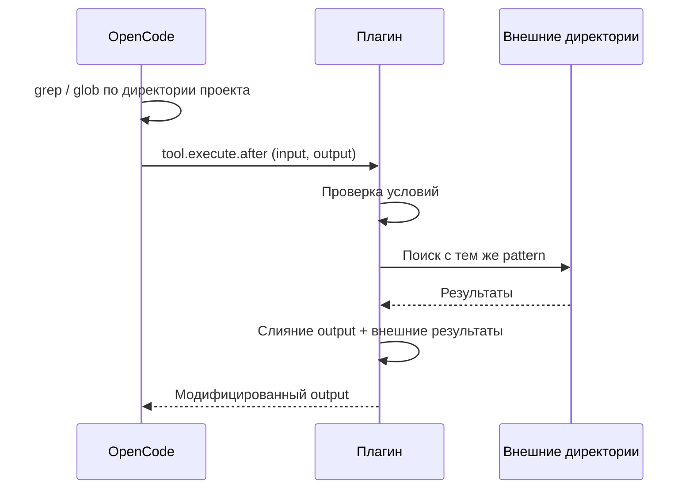
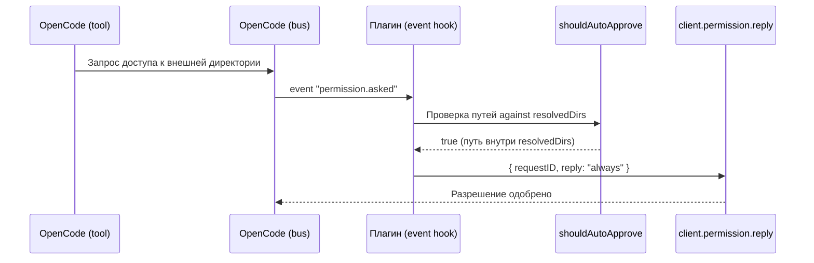

# Сценарии

## Основной сценарий

Плагин расширяет результаты поиска `grep` и `glob` файлами из внешних директорий.

1. OpenCode вызывает `grep` или `glob`.
2. Плагин перехватывает результат через хук `tool.execute.after`.
3. Если поиск выполнен по широкой директории (worktree, openDir или любой директории на прямом пути от openDir до configDir), плагин повторяет поиск с теми же условиями во внешних директориях, не покрытых основным поиском.
4. Внешние результаты дописываются к исходному ответу.
5. Если не все внешние результаты уместились в бюджет — к ответу добавляется перечень директорий, где остались не показанные результаты (директории без результатов и те, чьи результаты полностью уместились, исключаются).

---

## Авто-permit (автоматическое разрешение доступа)

Плагин автоматически одобряет запросы OpenCode на доступ к внешним директориям (`external_directory`), если запрошенные пути находятся внутри настроенных внешних директорий. Это устраняет необходимость ручного подтверждения для каждого обращения к файлам, которые пользователь уже явно указал в конфигурации.

> Подробное описание: [Авто-permit](scenarios/auto-permit.md)

---

## Подробные разделы

- [Инициализация плагина](scenarios/plugin-initialization.md) — проверка конфигурации, вычисление basePath, разрешение внешних директорий, обнаружение ripgrep (поиск в PATH и директориях OpenCode, кэширование), поиск zod, сопоставление путей при поиске configDir, глубокая вложенность с промежуточными конфигами
- [Обработка grep / glob](scenarios/grep-glob-processing.md) — цепочка проверок, фильтр include для grep, runtime-подсказка при отсутствии rg, ограничения результатов, алгоритм исключений, реализация glob-поиска (Bun.Glob / walkDir fallback), накопление метаданных, слияние результатов, фильтрация подсказки по результатам поиска
- [deps_read](scenarios/deps-read.md) — кастомный tool для чтения файлов из внешних директорий, формат вывода readFileContent (нумерация, footer, ошибки)
- [Авто-permit](scenarios/auto-permit.md) — автоматическое одобрение запросов `external_directory`, извлечение путей из glob и metadata, соображения безопасности
- [Toast-уведомления об ошибках](scenarios/toast-notifications.md) — перечень toast-уведомлений и порядок проверок
- [Логирование](scenarios/logging.md) — структурированные логи через client.app.log, уровни, ключевые точки логирования, fallback через EXT_SEARCH_DEBUG
- [Внутренняя инфраструктура](scenarios/internal-infrastructure.md) — FsHost (абстракция файловой системы), namespace _testing, spawn (Bun.spawn / child_process fallback), IGNORE_TOOLS
