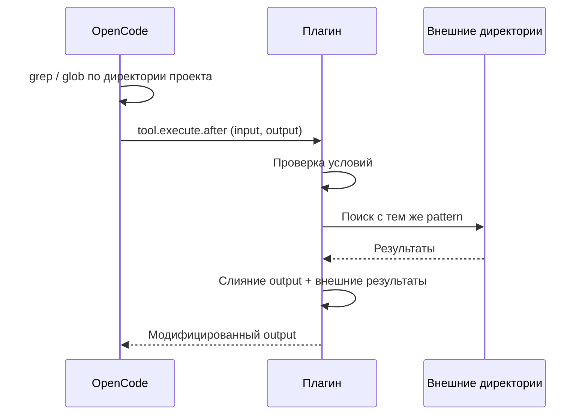
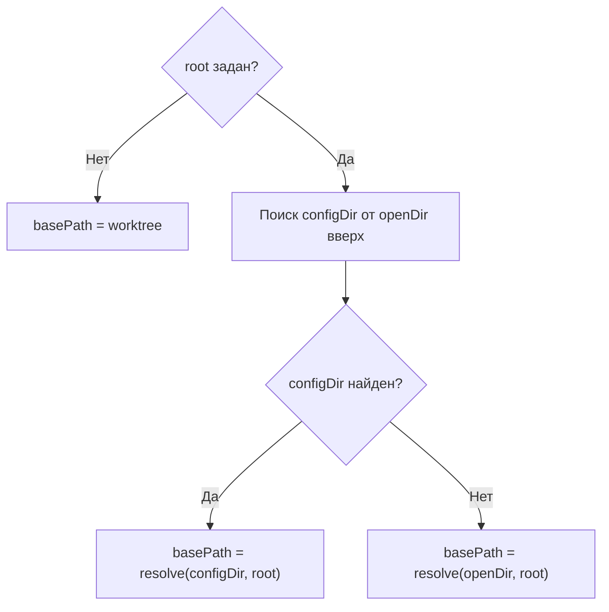
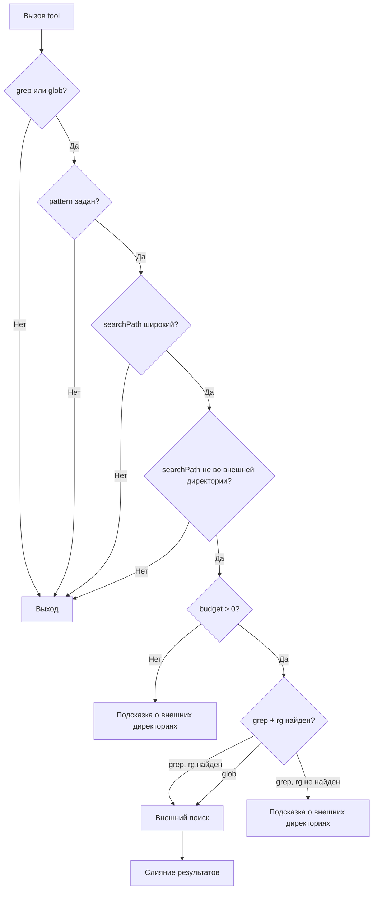
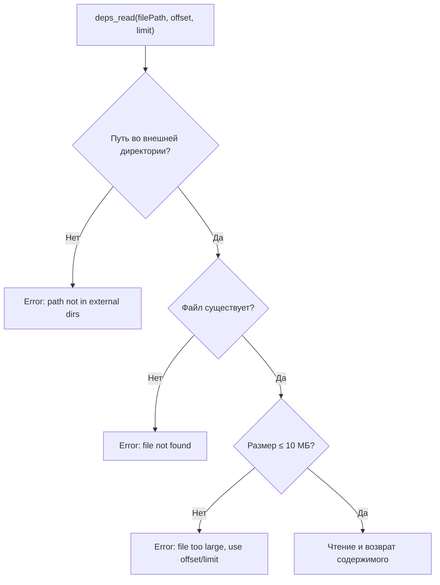

# Сценарии

## Основной сценарий

Плагин расширяет результаты поиска `grep` и `glob` файлами из внешних директорий.

1. OpenCode вызывает `grep` или `glob`.
2. Плагин перехватывает результат через хук `tool.execute.after`.
3. Если поиск выполнен по директории проекта (worktree или openDir), плагин повторяет поиск с теми же условиями во внешних директориях.
4. Внешние результаты дописываются к исходному ответу.
5. К ответу добавляется перечень внешних директорий.

---

## 1. Инициализация плагина

При запуске OpenCode вызывает плагин, передавая контекст (`directory`, `worktree`) и параметры из `opencode.json`.

### 1.1. Проверка конфигурации

Если параметр `directories` отсутствует или пуст — плагин показывает toast-уведомление (`warning`) с описанием проблемы, возвращает пустой объект и завершает работу. Хуки и tools не регистрируются, поведение OpenCode не изменяется.

### 1.2. Вычисление базовой директории (basePath)

При поиске configDir плагин обходит все `opencode.json`/`opencode.jsonc` файлы от openDir вверх до корня. Если встречается файл с невалидным JSON — показывается toast-уведомление (`error`) с путём файла и описанием ошибки парсинга, обход продолжается. Если ни один конфиг не ссылается на данный плагин — показывается toast (`warning`) с сообщением, что opencode.json не найден.

### 1.3. Разрешение внешних директорий (resolvedDirs)

Каждая запись из `directories` разрешается относительно basePath:

| Формат пути | Правило разрешения |
|---|---|
| `~/…` | Относительно `$HOME` |
| `/absolute/path` | Как есть |
| `relative/path` | Относительно basePath |

После разрешения каждая директория проверяется на существование. Несуществующие или неявляющиеся-директориями — пропускаются с предупреждением в лог. Для каждой отсутствующей директории показывается toast (`warning`) с указанием пути.

Если после фильтрации resolvedDirs пуст — показывается toast (`warning`) с сообщением, что нет валидных внешних директорий, и плагин завершает работу без регистрации хуков.

### 1.4. Обнаружение ripgrep

На этом же этапе плагин ищет бинарник `rg` в системе. Результат сохраняется и используется при обработке `grep`. Если `rg` не найден — показывается toast (`warning`) с сообщением, что grep-поиск будет ограничен.

### 1.5. Создание deps_read

Плагин пытается создать tool `deps_read`. Если библиотека `zod` не обнаружена — показывается toast (`warning`) с сообщением, что deps_read будет недоступен.

---

## 2. Обработка grep / glob

При каждом вызове любого tool срабатывает хук `tool.execute.after`. Обработка происходит только для `grep` и `glob`, все остальные tools игнорируются.

### 2.1. Цепочка проверок

Внешний поиск выполняется только если пройдены все проверки:

**Широкий searchPath** — не указан, либо совпадает с worktree или openDir. Если указан произвольный подкаталог — поиск по внешним директориям пропускается.

### 2.2. Ограничения результатов

| Параметр | Значение | Описание |
|---|---|---|
| Общий бюджет | 100 непустых строк | Бюджет для внешних результатов: `100 − строки_исходного_ответа` |
| maxResults | 50 (по умолчанию) | Максимум внешних результатов за вызов, настраивается в конфиге |
| Итоговый лимит | `min(budget, maxResults)` | Фактическое ограничение на количество внешних результатов |
| Усечение строки grep | 2000 символов | Каждая совпавшая строка обрезается, добавляется `...` |
| excludePatterns | `node_modules`, `.git`, `dist` | Исключаемые из поиска директории, настраивается в конфиге |

### 2.3. Слияние результатов

Если внешний поиск вернул результаты:

- **Исходный ответ содержит «No files found»** — заменяется на внешние результаты целиком.
- **Исходный ответ содержит совпадения** — внешние результаты дописываются после разделителя `--- External dependencies ---`.
- **Внешний поиск не дал результатов** — исходный ответ не изменяется.

Если количество внешних результатов достигло бюджета — после результатов добавляется подсказка с перечнем внешних директорий и рекомендацией использовать `deps_read`.

---

## 3. deps_read

Плагин регистрирует кастомный tool `deps_read` для чтения файлов из внешних директорий.

**Аргументы:**

| Аргумент | Обязательный | Описание |
|---|---|---|
| `filePath` | Да | Абсолютный путь к файлу |
| `offset` | Нет | Номер начальной строки (с 1) |
| `limit` | Нет | Максимум строк (по умолчанию 2000) |

Дополнительные ограничения при чтении: каждая строка обрезается до 2000 символов.

Если библиотека `zod` не обнаружена — tool `deps_read` не регистрируется, плагин показывает toast-уведомление (`warning`) и логирует предупреждение.

---

## 4. Toast-уведомления об ошибках

При инициализации плагин показывает toast-уведомления через OpenCode API (`client.showToast`) для не-фатальных проблем. Порядок проверок:

| # | Условие | variant | Действие |
|---|---|---|---|
| 1 | `directories` пуст или отсутствует | warning | Возврат `{}` (плагин неактивен) |
| 2 | Ошибка парсинга opencode.json | error | Продолжение поиска других конфигов |
| 3 | opencode.json не найден | warning | Продолжение работы |
| 4 | Директория из списка не найдена | warning | Одна на каждую отсутствующую |
| 5 | Все директории отсутствуют | warning | Возврат `{}` (плагин неактивен) |
| 6 | rg не найден | warning | Grep ограничен, glob работает |
| 7 | zod не найден | warning | deps_read недоступен |
