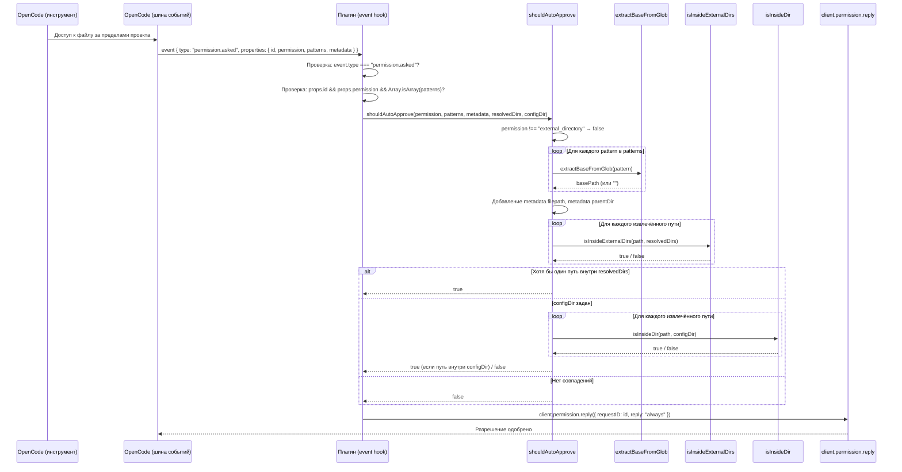

# Авто-permit — автоматическое разрешение доступа к внешним директориям

## Обзор

При работе с внешними директориями OpenCode запрашивает у пользователя разрешение на доступ (`permission.asked` с типом `external_directory`) каждый раз, когда инструмент (например, `read`) обращается к файлу за пределами открытого проекта. Для файлов из настроенных внешних директорий это создаёт излишние прерывания: тот факт, что пользователь явно указал директории в конфигурации плагина (`opencode.json` → `directories`), уже подразумевает согласие на доступ.

Плагин решает эту проблему, автоматически одобряя запросы `external_directory` для путей, находящихся внутри:
- **настроенных внешних директорий** (resolvedDirs) — поскольку пользователь явно указал их в конфигурации;
- **configDir** — поскольку при включённом `strict_path_restrictions` пути поиска перенаправляются в configDir (см. [Ограничение путей поиска](strict-path-restrictions.md)), а в режиме без git configDir может находиться за пределами `Instance.directory`, что провоцирует запрос `external_directory`.

## Поток обработки



## Создание обработчика

Обработчик создаётся фабричной функцией `createAutoPermitHandler` (модуль `auto-permit.ts`) при инициализации плагина:

```typescript
const autoPermitHandler = createAutoPermitHandler(dirsResult.resolved, ctx.client, configResult.dir)
```

Функция принимает:

| Параметр | Тип | Описание |
|---|---|---|
| `resolvedDirs` | `string[]` | Массив абсолютных путей к настроенным внешним директориям |
| `client` | `PermissionClient` | Объект с методом `permission.reply` для отправки ответа на запрос разрешения |
| `configDir` | `string \| null` | Опциональный абсолютный путь к директории конфига. При передаче включает авто-одобрение для путей внутри configDir |

Возвращает async-функцию, совместимую с хуком `event` плагина. В `plugin.ts` обработчик регистрируется как поле `event` в возвращаемом объекте:

```typescript
return {
  event: autoPermitHandler,
  // ... остальные хуки
}
```

## Логика принятия решения

Функция `shouldAutoApprove` реализует центральную логику принятия решения об авто-одобрении:

```typescript
function shouldAutoApprove(
  permission: string,
  patterns: string[],
  metadata: Record<string, unknown>,
  resolvedDirs: string[],
  configDir: string | null,
): boolean
```

### Условия авто-одобрения

1. **Тип разрешения** — только `external_directory`. Все остальные типы разрешений игнорируются.
2. **Наличие путей** — из события извлекаются пути, которые проверяются на принадлежность к resolvedDirs или configDir.
3. **Принадлежность к resolvedDirs** — хотя бы один извлечённый путь должен находиться внутри одной из внешних директорий.
4. **Принадлежность к configDir** (если configDir задан) — хотя бы один извлечённый путь должен находиться внутри configDir. Эта проверка выполняется, если путь не найден внутри resolvedDirs.

### Извлечение путей

Пути извлекаются из трёх источников:

| Источник | Поле | Обработка |
|---|---|---|
| Glob-паттерны | `patterns[]` | Каждый паттерн обрабатывается через `extractBaseFromGlob` |
| Путь к файлу | `metadata.filepath` | Используется как есть (если является строкой) |
| Родительская директория | `metadata.parentDir` | Используется как есть (если является строкой) |

### Извлечение пути из glob-паттерна

Функция `extractBaseFromGlob` извлекает базовый абсолютный путь из glob-паттерна:

```typescript
function extractBaseFromGlob(pattern: string): string {
  const clean = pattern.replace(/\/\*\*$/, "").replace(/\/\*$/, "")
  if (path.isAbsolute(clean)) return clean
  return ""
}
```

- Удаляет суффикс `/**` (рекурсивный glob)
- Удаляет суффикс `/*` (одноуровневый glob)
- Если результат — абсолютный путь, возвращает его; иначе возвращает пустую строку (неабсолютные паттерны не дают однозначного базового пути)

Примеры:

| Паттерн | Результат |
|---|---|
| `/home/user/monorepo/shared-types/**` | `/home/user/monorepo/shared-types` |
| `/home/user/monorepo/common-utils/*` | `/home/user/monorepo/common-utils` |
| `/home/user/monorepo/shared-types` | `/home/user/monorepo/shared-types` |
| `relative/path/**` | `""` |

### Проверка принадлежности к resolvedDirs

Функция `isInsideExternalDirs` проверяет, находится ли целевой путь внутри одной из внешних директорий:

```typescript
function isInsideExternalDirs(targetPath: string, resolvedDirs: string[]): boolean {
  const normalized = path.resolve(targetPath)
  return resolvedDirs.some(
    (d) => normalized === d || normalized.startsWith(d + path.sep),
  )
}
```

Путь считается находящимся внутри внешней директории, если:
- Он **точно совпадает** с одной из resolvedDirs, **или**
- Он **начинается** с одной из resolvedDirs + разделитель пути (`/` или `\`)

### Проверка принадлежности к configDir

Функция `isInsideDir` проверяет, находится ли целевой путь внутри указанной директории:

```typescript
function isInsideDir(targetPath: string, dir: string): boolean {
  const normalized = path.resolve(targetPath)
  return normalized === dir || normalized.startsWith(dir + path.sep)
}
```

Путь считается находящимся внутри директории, если:
- Он **точно совпадает** с `dir`, **или**
- Он **начинается** с `dir` + разделитель пути (`/` или `\`)

Эта функция используется для проверки принадлежности к configDir в дополнение к проверке resolvedDirs. Проверка configDir выполняется после проверки resolvedDirs — если путь уже найден во внешних директориях, повторная проверка не требуется.

#### Мотивация

Авто-одобрение configDir необходимо в следующем сценарии:

1. Включена опция `strict_path_restrictions` — хук `tool.execute.before` перенаправляет запрещённые пути поиска в configDir (см. [Ограничение путей поиска](strict-path-restrictions.md)).
2. В режиме без git configDir может находиться за пределами `Instance.directory` (открытого проекта OpenCode).
3. Когда OpenCode выполняет `glob`/`grep` по пути configDir (после перенаправления), он запрашивает разрешение `external_directory`.
4. Без авто-одобрения configDir пользователь получал бы запрос на разрешение для каждого поиска, перенаправленного в configDir — именно того сценария, который `strict_path_restrictions` должен обрабатывать бесшумно.

## Действия при одобрении

Если `shouldAutoApprove` возвращает `true`, обработчик вызывает:

```typescript
await client.permission.reply({ requestID: id, reply: "always" })
```

Параметр `reply: "always"` указывает OpenCode запомнить одобрение для данной директории и не запрашивать разрешение повторно.

Если `client.permission.reply` недоступен (поле `permission` отсутствует в клиенте), обработчик логирует предупреждение и не выполняет действий.

Ошибки при вызове `reply` перехватываются и логируются на уровне `warn`.

## Соображения безопасности

### Что одобряется

- **Только `external_directory`** — запросы других типов разрешений (например, выполнение команд, доступ к сети) никогда не обрабатываются авто-permit.
- **Только внутри resolvedDirs или configDir** — доступ к путям за пределами настроенных внешних директорий и configDir не одобряется автоматически.
- **Явное согласие** — пользователь явно указал внешние директории в `opencode.json`, что является достаточным основанием для авто-одобрения доступа к файлам внутри них.
- **configDir как рабочая область** — configDir содержит `opencode.json` и является корневой директорией команды; файлы в ней по определению доступны для работы.

### Что не одобряется

- Запросы разрешения типов, отличных от `external_directory`.
- Запросы, где ни один из извлечённых путей не находится внутри resolvedDirs или configDir.
- Запросы с неабсолютными glob-паттернами (если нет метаданных с абсолютными путями).

## Логирование

Обработчик логирует ключевые события:

| Событие | Уровень | Данные |
|---|---|---|
| Успешное одобрение | `info` | `requestId`, `permission`, `patterns` |
| Недоступность `client.permission.reply` | `warn` | `requestId` |
| Ошибка при вызове `reply` | `warn` | `requestId`, `error` |

Подробнее о системе логирования см. [Логирование](logging.md).
