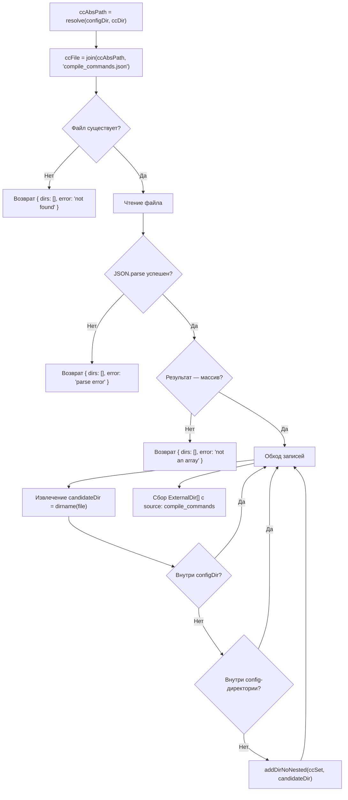

# Поддержка compile_commands.json

Плагин умеет автоматически извлекать директории исходных файлов из базы компиляции `compile_commands.json` и использовать их как внешние директории для поиска. Это позволяет автоматически определять зависимости без явного перечисления в параметре `directories`.

## Конфигурация

В `opencode.json` добавляется опциональный параметр `compile_commands_dir` — относительный путь к директории с файлом `compile_commands.json` относительно configDir:

```jsonc
{
  "plugin": [
    [
      "./.opencode/plugins/ext-search",
      {
        "root": "../../",
        "directories": ["shared-types"],
        "compile_commands_dir": "../build"
      }
    ]
  ]
}
```

Плагин активен, если указан хотя бы один из параметров: `directories` или `compile_commands_dir`.

## Парсинг compile_commands.json

Функция `parseCompileCommands(ccDir, configDir, configDirs)` выполняет следующие шаги:



### Алгоритм извлечения директорий

Для каждой записи из `compile_commands.json`:

1. **Разрешение пути файла** — `absFile = entry.file` если путь абсолютный, иначе `path.resolve(entry.directory, entry.file)`
2. **Извлечение директории** — `candidateDir = path.dirname(absFile)`
3. **Фильтрация** — директория пропускается, если:
   - Совпадает с configDir или является его поддиректорией
   - Совпадает с одной из config-внешних директорий или является её поддиректорией
4. **Дедупликация** — через `addDirNoNested`:
   - Если кандидат является поддиректорией уже добавленной — пропускается
   - Если кандидат является родительской к уже добавленным — дочерние удаляются, кандидат добавляется
   - Иначе — просто добавляется

### Очистка памяти

После извлечения директорий ссылки на распарсенный JSON обнуляются (`raw = null; entries = null`) для освобождения памяти.

## Пометка config-директорий как disabled

Функция `markDisabledConfigDirs(configDirs, ccDirs)` проверяет каждую config-директорию: если она является поддиректорией одной из cc-директорий, помечается `disabled: true`.

Это предотвращает дублирование: cc-директория покрывает более широкую область файловой системы, и добавление вложенной config-директории привело бы к повторным результатам.

```
config-директория: /monorepo/shared-types    ← disabled (внутри /monorepo)
cc-директория:     /monorepo                  ← активна
```

## Объединение директорий

После парсинга и пометки disabled формируется массив `activeDirPaths` — пути всех не-disabled директорий:

```
allDirs = [...configExternalDirs, ...ccDirs]
activeDirPaths = allDirs.filter(d => !d.disabled).map(d => d.path)
```

`activeDirPaths` передаётся во все потребители: вспомогательный поиск, авто-permit, strict-paths, deps_read.

## Обработка ошибок

| Условие | variant | Сообщение |
|---|---|---|
| Файл не найден | error | `compile_commands.json not found at <абсолютный_путь>` |
| Ошибка чтения файла | error | `Failed to read compile_commands.json: <error>` |
| Невалидный JSON | error | `Failed to parse compile_commands.json: <error>` |
| Результат не массив | error | `compile_commands.json is not an array` |

При любой ошибке парсинга плагин продолжает работу с config-директориями. Toast показывается с `variant: "error"`.

## Логирование

- Debug: путь резолвинга ccDir, время парсинга JSON, количество записей
- Info: завершение парсинга (количество извлечённых директорий), пометка config-директорий как disabled
- Warn: файл не найден
- Error: ошибка чтения, ошибка парсинга JSON
