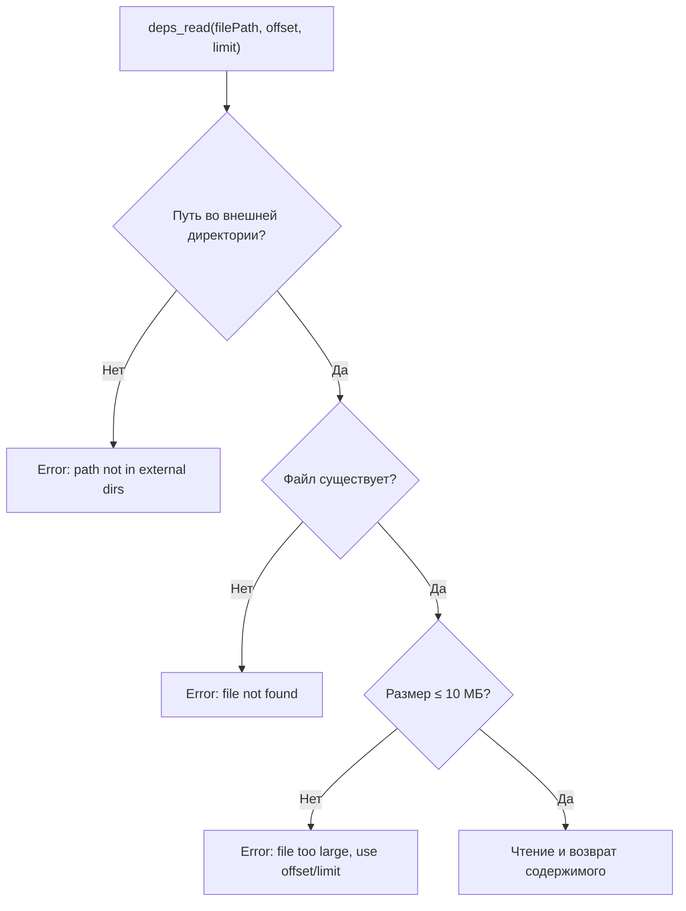

# deps_read

Плагин регистрирует кастомный tool `deps_read` для чтения файлов из внешних директорий.

**Аргументы:**

| Аргумент | Обязательный | Описание |
|---|---|---|
| `filePath` | Да | Абсолютный путь к файлу |
| `offset` | Нет | Номер начальной строки (с 1) |
| `limit` | Нет | Максимум строк (по умолчанию 2000) |



Дополнительные ограничения при чтении: каждая строка обрезается до 2000 символов.

Если библиотека `zod` не обнаружена — tool `deps_read` не регистрируется, плагин показывает toast-уведомление (`warning`) и логирует предупреждение.

## Формат вывода readFileContent

Содержимое файла возвращается в виде пронумерованных строк:

```
1: import { UserProfile } from "./types"
2: 
3: export function process(user: UserProfile) {
...
```

### Нумерация строк

- Каждая строка имеет формат `{lineNumber}: {content}`.
- `offset` по умолчанию равен 1 (первая строка файла).
- `limit` по умолчанию равен 2000.
- Если строка длиннее 2000 символов — она обрезается с добавлением `...` в конце.

### Footer при усечении

Если файл содержит больше строк, чем запрошено (`offset` + `limit` > видимых), после содержимого добавляется информационная строка:

```
(showing lines 1-2000 of 3500)
```

### Ошибка при пустом диапазоне

Если запрошенный диапазон строк не пересекается с содержимым файла (например, `offset=5000` при 100 строках), возвращается сообщение об ошибке:

```
Error: no lines in range 5000-6999 (file has 100 lines)
```
