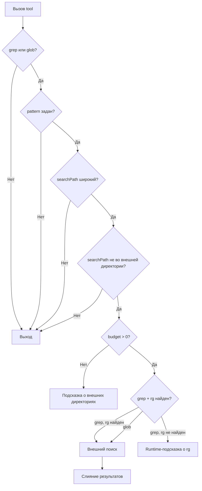
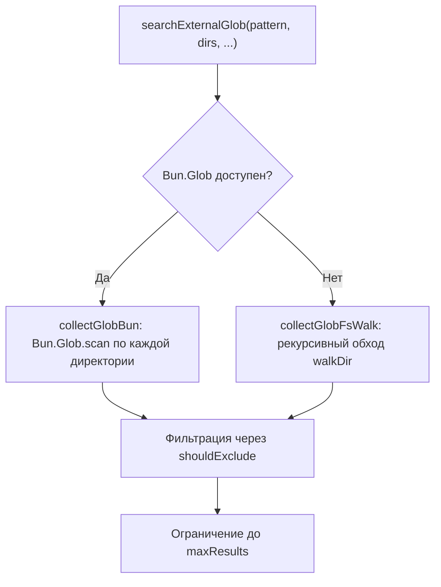

# Обработка grep / glob

При каждом вызове любого tool срабатывает хук `tool.execute.after`. Обработка происходит только для `grep` и `glob`, все остальные tools игнорируются (см. [IGNORE_TOOLS](internal-infrastructure.md#ignore_tools--набор-игнорируемых-инструментов)).

## Цепочка проверок

Внешний поиск выполняется только если пройдены все проверки:



**Широкий searchPath** — не указан, либо совпадает с worktree, openDir или любой директорией на прямом пути от openDir до configDir (включая обе). Если указан произвольный подкаталог, не лежащий на этом пути — поиск по внешним директориям пропускается.

## Фильтрация покрытых директорий

Перед выполнением внешнего поиска плагин исключает из массива `resolvedDirs` директории, которые уже покрыты основным поиском. Директория считается покрытой, если она совпадает с `searchPath` (или `worktree`, если `searchPath` не указан) или является его подкаталогом.

Фильтрация выполняется функцией `filterCoveredDirs` из `paths.ts` и применяется:
- к списку директорий для вспомогательного поиска (grep/glob)
- к списку директорий в подсказках (`buildHint`, `buildRgFallbackHint`)

Если после фильтрации не осталось ни одной внешней директории — внешний поиск пропускается полностью.

## Фильтр include для grep

При обработке `grep` плагин извлекает аргумент `include` из входных параметров и передаёт его как флаг `--glob` в ripgrep. Это позволяет фильтровать результаты по расширению или имени файла (например, `include: "*.ts"`).

Пример формируемой команды rg:

```
rg -n --hidden --no-messages --field-match-separator=| --max-count=50 --glob !node_modules --glob !.git --glob !dist --glob "*.ts" --regexp "pattern" /path/to/ext-dir1 /path/to/ext-dir2
```

## Runtime-подсказка при отсутствии rg

Если при обработке `grep` выясняется, что `rg` не найден (переменная `rgPath` равна `null`), внешний grep-поиск не выполняется. Вместо этого к output дописывается `buildRgFallbackHint` — подсказка, указывающая на недоступность ripgrep и перечисляющая абсолютные пути внешних директорий:

```
(ripgrep not available. External dependency directories: /path/dir1, /path/dir2.
Use the deps-read tool or search with glob specifying an external directory path to explore their contents.)
```

Это отличается от toast-уведомления при инициализации: подсказка добавляется **при каждом вызове grep**, чтобы ИИ имел актуальную информацию о внешних директориях даже в середине сессии.

## Ограничения результатов

| Параметр | Значение | Описание |
|---|---|---|
| Общий бюджет | 100 непустых строк | Бюджет для внешних результатов: `100 − строки_исходного_ответа` |
| maxResults | 50 (по умолчанию) | Максимум внешних результатов за вызов, настраивается в конфиге |
| Итоговый лимит | `min(budget, maxResults)` | Фактическое ограничение на количество внешних результатов |
| Усечение строки grep | 2000 символов | Каждая совпавшая строка обрезается, добавляется `...` |
| excludePatterns | `node_modules`, `.git`, `dist` | Исключаемые из поиска директории, настраивается в конфиге |

## Алгоритм исключений

Исключение файлов и директорий (определено в `exclusion.ts`) работает по двум правилам в зависимости от типа паттерна:

**Паттерн без диких карт** (не содержит `*`, `?`, `[`): проверяется каждый сегмент пути. Если любой сегмент совпадает с паттерном — путь исключается. Например, паттерн `"node_modules"` исключит `src/node_modules/pkg/file.ts`.

**Паттерн с дикими картами** (`*`, `?`, `[`): проверяется только имя файла (basename) через glob-matching. Паттерн преобразуется в регулярное выражение: `*` → `.*`, `?` → `.`, остальные спецсимволы экранируются.

## Реализация glob-поиска

Glob-поиск во внешних директориях выполняется в два этапа с автоматическим выбором доступного API:



- **Bun.Glob** (`collectGlobBun`) — используется, если runtime предоставляет `Bun.Glob`. Паттерн передаётся нативно.
- **walkDir** (`collectGlobFsWalk`) — fallback при отсутствии Bun. Выполняет рекурсивный обход директорий через `fs.readdirSync`, фильтруя через `shouldExclude`. Паттерн при этом **не применяется** — возвращаются все файлы, не попавшие под исключения.

**Примечание:** при использовании walkDir-fallback glob-паттерн не фильтрует результаты, поэтому количество файлов может быть больше, чем при использовании Bun.Glob. Ограничение `maxResults` применяется после обхода.

## Накопление метаданных

После слияния результатов плагин обновляет поле `output.metadata`:

| Tool | Ключ | Значение |
|---|---|---|
| glob | `count` | Количество найденных внешних файлов |
| grep | `matches` | Количество найденных внешних совпадений |

Значения **накапливаются**: если в `metadata` уже есть значение для ключа, новое прибавляется к существующему. Это позволяет корректно учитывать результаты при многократных вызовах.

## Слияние результатов

Если внешний поиск вернул результаты:

- **Исходный ответ содержит "No files found"** — заменяется на внешние результаты целиком.
- **Исходный ответ содержит совпадения** — внешние результаты дописываются после разделителя `--- External dependencies ---`.
- **Внешний поиск не дал результатов** — исходный ответ не изменяется.

Если количество внешних результатов достигло бюджета — после результатов добавляется подсказка с перечнем внешних директорий и рекомендацией использовать `deps_read`.
