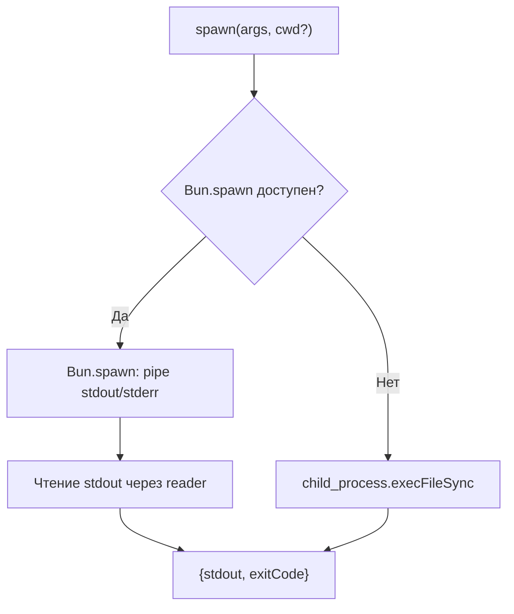

# Внутренняя инфраструктура

## FsHost — абстракция файловой системы

Интерфейс `FsHost` (определён в `fs-host.ts`) предоставляет минимальный набор синхронных операций над файловой системой, необходимых плагину:

| Метод | Сигнатура | Описание |
|---|---|---|
| `existsSync` | `(path: string) => boolean` | Проверка существования пути |
| `readFileSync` | `(path: string, encoding: string) => string` | Чтение файла как текст |
| `statSync` | `(path: string) => { isDirectory(): boolean; size: number }` | Получение метаданных |

По умолчанию все методы делегируют к стандартному модулю `fs` Node.js. Подмена реализации через `setFsHost` используется исключительно в интеграционных тестах для изоляции от реальной файловой системы.

## Namespace `_testing`

Экспортируемый объект `_testing` предоставляет функции для управления внутренним состоянием плагина в тестовом окружении:

| Функция | Описание |
|---|---|
| `setFsHost(fsHost)` | Устанавливает кастомную реализацию FsHost |
| `resetFsHost()` | Восстанавливает стандартную реализацию (делегирование к `fs`) |
| `setPluginDirOverride(dir)` | Переопределяет директорию плагина для поиска configDir |
| `resetConfigState()` | Сбрасывает переопределение директории плагина |
| `setRgPathOverride(rgPath)` | Устанавливает путь к rg (`null` — «rg не найден», `undefined` — сброс) |
| `resetRgCache()` | Сбрасывает кэш поиска rg |
| `resetAll()` | Вызывает все reset-функции последовательно |

Все override-функции влияют только на текущий процесс и не сохраняются между запусками.

## Spawn — запуск внешних процессов

Функция `spawn` (определена в `process.ts`) обеспечивает унифицированный интерфейс для запуска внешних процессов с автоматическим выбором доступного runtime:



**Приоритет runtime:**

1. **Bun.spawn** — если `Bun` доступен и содержит метод `spawn`. Используется потоковое чтение stdout через `ReadableStream.getReader()`.
2. **child_process.execFileSync** — fallback для сред без Bun. Максимальный размер буфера — 10 МБ.

**Возвращаемое значение:** `{ stdout: string, exitCode: number }`.

Плагин использует `spawn` исключительно для запуска `rg` при grep-поиске во внешних директориях.

## IGNORE_TOOLS — набор игнорируемых инструментов

Множество `IGNORE_TOOLS` (определено в `constants.ts`) содержит имена инструментов OpenCode, для которых плагин **не выполняет** перехват в хуке `tool.execute.after`:

```
bash, read, write, edit, apply_patch, task, webfetch, websearch,
codesearch, skill, question, todo, batch, plan, lsp, deps_read
```

Инструменты `grep` и `glob` не входят в этот набор — они обрабатываются специализированными обработчиками. Инструмент `deps_read` добавлен в набор игнорируемых, чтобы избежать рекурсивной обработки собственного tool'а.
