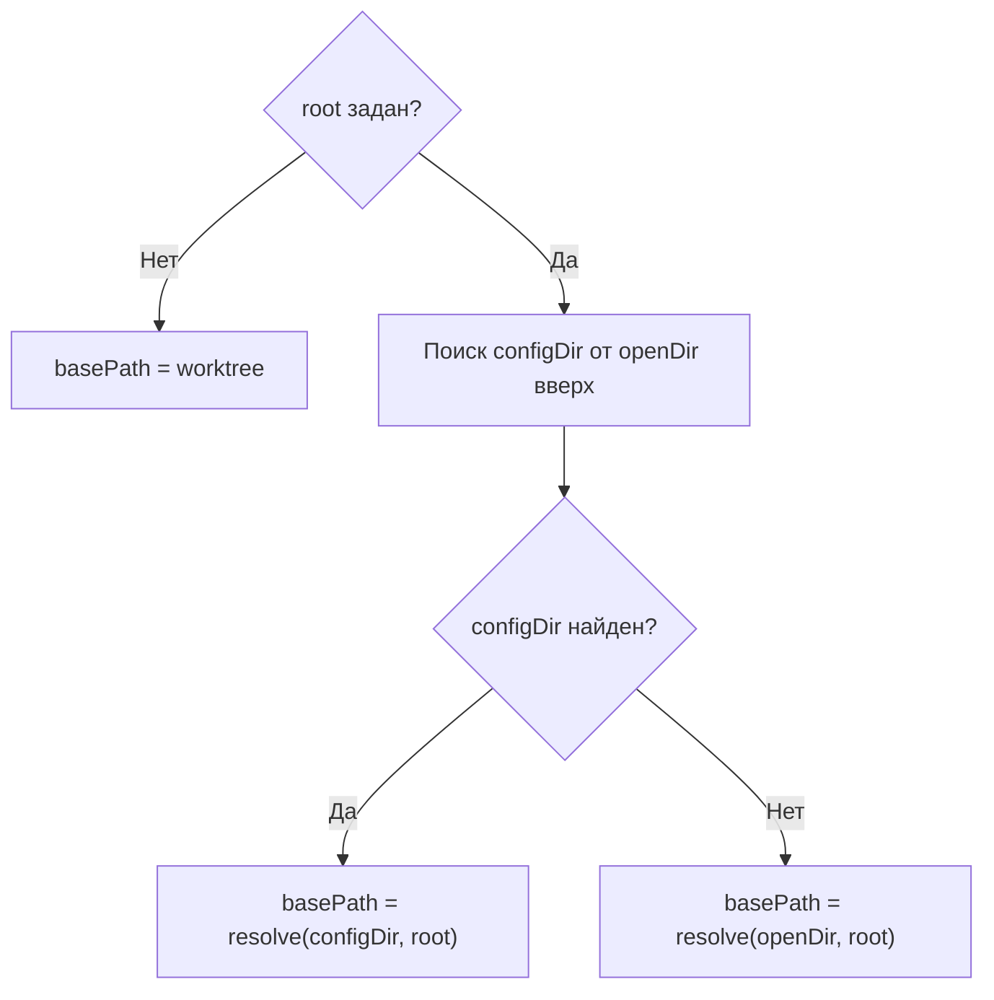
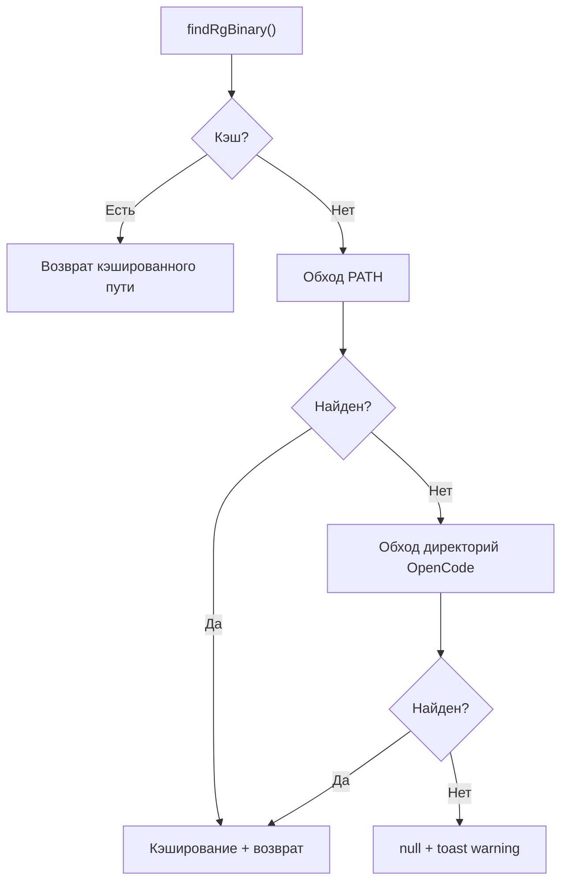

# Инициализация плагина

При запуске OpenCode вызывает плагин, передавая контекст (`directory`, `worktree`) и параметры из `opencode.json`.

## Проверка конфигурации

Если параметр `directories` отсутствует или пуст **и** параметр `compile_commands_dir` не указан — плагин показывает toast-уведомление (`warning`) с описанием проблемы, возвращает пустой объект и завершает работу. Хуки и tools не регистрируются, поведение OpenCode не изменяется.

## Вычисление базовой директории (basePath)



При поиске configDir плагин обходит все `opencode.json`/`opencode.jsonc` файлы от openDir вверх до корня. Если встречается файл с невалидным JSON — показывается toast-уведомление (`error`) с путём файла и описанием ошибки парсинга, обход продолжается. Если ни один конфиг не ссылается на данный плагин — показывается toast (`warning`) с сообщением, что opencode.json не найден.

### Сопоставление путей при поиске configDir

Для каждого `plugin`-entry в конфиге плагин разрешает путь плагина относительно директории конфига и сравнивает с реальным расположением плагина. Сопоставление выполняется по двум критериям:

| Тип сопоставления | Условие | Пример |
|---|---|---|
| Точное совпадение | `resolved === pluginDir` | Конфиг указывает `"./plugins/ext-search"` и плагин находится именно там |
| Префиксное совпадение | `pluginDir.startsWith(resolved + path.sep)` | Конфиг указывает `"./plugins"`, а плагин находится в `"./plugins/ext-search"` |

Префиксное сопоставление позволяет указать в конфиге родительскую директорию плагина.

### Глубокая вложенность с промежуточными конфигами

В монорепозиториях с иерархической структурой между openDir и корнем могут находиться промежуточные `opencode.json` файлы. Алгоритм поиска configDir обходит **все** уровни снизу вверх, пока не найдёт конфиг, ссылающийся на данный плагин:

```
монорепа/
├── opencode.json              ← корневой конфиг (может ссылаться на плагин)
├── shared-types/
└── team-alpha/
    ├── opencode.json          ← промежуточный конфиг (может не содержать ссылку на плагин)
    └── services/
        └── web/
            └── my-app/        ← openDir
                └── src/
```

Если промежуточный `team-alpha/opencode.json` содержит невалидный JSON — показывается toast (`error`) и обход продолжается к корневому конфигу. Если промежуточный конфиг валиден, но не ссылается на данный плагин — он пропускается без уведомления.

## Разрешение внешних директорий (resolvedDirs)

Каждая запись из `directories` разрешается относительно basePath:

| Формат пути | Правило разрешения |
|---|---|
| `~/…` | Относительно `$HOME` |
| `/absolute/path` | Как есть |
| `relative/path` | Относительно basePath |

После разрешения каждая директория проверяется на существование. Несуществующие или неявляющиеся-директориями — пропускаются с предупреждением в лог. Для каждой отсутствующей директории показывается toast (`warning`) с указанием пути.

Если после фильтрации resolvedDirs пуст — показывается toast (`warning`) с сообщением, что нет валидных внешних директорий, и плагин завершает работу без регистрации хуков.

## Извлечение директорий из compile_commands.json

Если указан параметр `compile_commands_dir` и найден configDir, плагин вызывает `parseCompileCommands` для извлечения директорий исходных файлов из базы компиляции.

Подробное описание алгоритма см. в [Поддержка compile_commands.json](compile-commands.md).

Результатом является массив `ExternalDir[]` с `source: "compile_commands"`. При ошибке (файл не найден, невалидный JSON) показывается toast (`error`), но плагин продолжает работу с config-директориями.

## Объединение и фильтрация директорий

Config-директории и cc-директории объединяются в единый массив `allDirs: ExternalDir[]`. Затем выполняется:

1. **Пометка disabled** — config-директория помечается `disabled: true`, если она является поддиректорией одной из cc-директорий (функция `markDisabledConfigDirs`). Это исключает дублирование результатов: cc-директория покрывает более широкую область.
2. **Формирование activeDirPaths** — массив путей всех не-disabled директорий: `allDirs.filter(d => !d.disabled).map(d => d.path)`.
3. **Проверка активности** — если `activeDirPaths` пуст, показывается toast (`warning`) и плагин завершает работу.

`activeDirPaths` передаётся во все потребители: вспомогательный поиск, авто-permit, strict-paths, deps_read.

## Обнаружение ripgrep

Плагин ищет бинарник `rg` в два этапа. Результат кэшируется — повторный поиск не выполняется.



### Этап 1: поиск в PATH

Плагин перебирает все директории из переменной окружения `PATH`. На Windows дополнительно перебираются расширения из `PATHEXT` (`.COM`, `.EXE`, `.BAT`, `.CMD`).

### Этап 2: поиск в стандартных директориях OpenCode

Если `rg` не найден в PATH, плагин формирует список кандидат-директорий как декартово произведение платформенных базовых директорий и стандартных суффиксов. **Все** суффиксы комбинируются со **всеми** базовыми директориями независимо от платформы — это гарантирует обнаружение `rg` даже при нестандартных конфигурациях.

**Суффиксы (применяются ко всем платформам):**
- `opencode/bin`
- `.opencode/bin`
- `.cache/opencode/bin`
- `.local/share/opencode/bin`
- `Library/Caches/opencode/bin`
- `Library/Application Support/opencode/bin`

**Платформенные базовые директории:**

| Платформа | Базовые директории |
|---|---|
| Linux | `$XDG_CACHE_HOME` (default `~/.cache`), `$XDG_DATA_HOME` (default `~/.local/share`), `$HOME` |
| macOS | `$HOME` |
| Windows | `%LOCALAPPDATA%`, `%APPDATA%`, `%USERPROFILE%` |

Если `rg` не найден — показывается toast (`warning`) с сообщением, что grep-поиск будет ограничен.

## Создание deps_read

Плагин пытается создать tool `deps_read`. Для формирования схемы аргументов используется библиотека `zod`.

### Поиск zod

Zod ищется в два этапа:

1. **Прямой импорт** — `import("zod")`. Если zod доступен в module path — используется сразу.
2. **Bun.resolveSync** (только при доступности Bun) — поочерёдно пытается разрешить `"zod"` из следующих директорий:
   - `path.dirname(process.execPath)` — директория исполняемого файла Bun
   - `path.dirname(process.execPath) + "/.."` — родительская директория
   - `~/.opencode`
   - `$HOME`

Если zod не найден — показывается toast (`warning`) с сообщением, что deps_read будет недоступен. Плагин продолжает работу без регистрации tool `deps_read`, но хук `tool.execute.after` для `grep`/`glob` работает как обычно.
