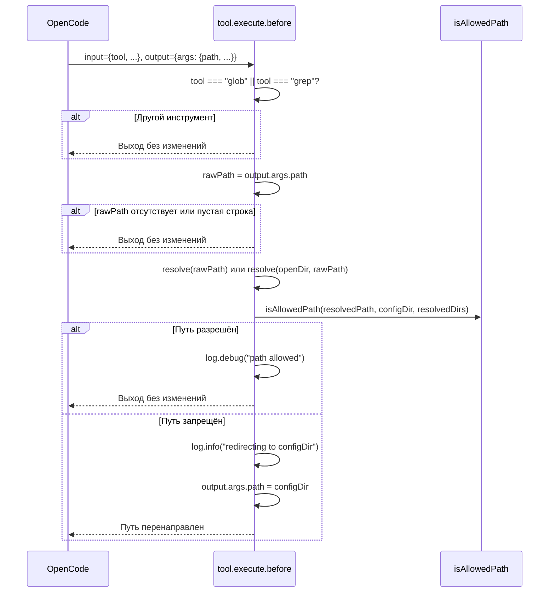

# Ограничение путей поиска (strict_path_restrictions)

## Обзор

При работе в монорепозитории ИИ может указать в вызове `glob` или `grep` произвольный путь, выходящий за пределы нужной области — например, корень монорепы или вообще несвязанную директорию. Опция `strict_path_restrictions` позволяет ограничить область поиска: если ИИ попытается выполнить поиск за пределами configDir и настроенных внешних директорий, путь будет автоматически перенаправлен в configDir.

Это полезно, когда необходимо гарантировать, что ИИ не «выходит» за пределы рабочей области команды, даже если формально имеет доступ к файловой системе.

## Конфигурация

Опция включается в `opencode.json`:

```jsonc
{
  "plugin": [
    [
      "./.opencode/plugins/ext-search",
      {
        "root": "../../",
        "directories": ["shared-types", "common-utils"],
        "strict_path_restrictions": true
      }
    ]
  ]
}
```

| Параметр | Тип | По умолчанию | Описание |
|---|---|---|---|
| `strict_path_restrictions` | `boolean` | `false` | При `true` перехватывает вызовы `glob`/`grep` через `tool.execute.before` и перенаправляет запрещённые пути в configDir |

## Регистрация хука

Хук `tool.execute.before` регистрируется **только** при одновременном выполнении двух условий:

1. `strict_path_restrictions: true` в конфигурации плагина
2. `configDir` определён (не `null`) — то есть плагин успешно нашёл `opencode.json`, ссылающийся на данный плагин

Если `configDir` равен `null` (например, `opencode.json` не найден при обходе от openDir), хук **не регистрируется**, даже если опция включена. В этом случае плагин также показывает toast-уведомление о том, что конфиг не найден (см. [Toast-уведомления](toast-notifications.md)).

```typescript
// plugin.ts
if (opts.strict_path_restrictions && configResult.dir) {
  hooks["tool.execute.before"] = createStrictPathBeforeHook(
    configResult.dir,
    dirsResult.resolved,
    openDir,
  )
}
```

## Поток обработки



## Создание обработчика

Обработчик создаётся фабричной функцией `createStrictPathBeforeHook` (модуль `strict-paths.ts`) при инициализации плагина:

```typescript
const hook = createStrictPathBeforeHook(configDir, resolvedDirs, openDir)
```

Функция принимает:

| Параметр | Тип | Описание |
|---|---|---|
| `configDir` | `string` | Абсолютный путь к директории конфига |
| `resolvedDirs` | `string[]` | Массив абсолютных путей к внешним директориям |
| `openDir` | `string` | Абсолютный путь к открытой директории (для разрешения относительных путей) |

Возвращает async-функцию, совместимую с хуком `tool.execute.before`. В `plugin.ts` обработчик регистрируется как поле `"tool.execute.before"` в возвращаемом объекте хуков.

## Логика проверки путей

Функция `isAllowedPath` определяет, находится ли целевой путь внутри разрешённой области:

```typescript
function isAllowedPath(
  searchPath: string,
  configDir: string,
  resolvedDirs: string[],
): boolean {
  const normalized = path.resolve(searchPath)

  if (normalized === configDir || normalized.startsWith(configDir + path.sep)) {
    return true
  }

  for (const d of resolvedDirs) {
    if (normalized === d || normalized.startsWith(d + path.sep)) {
      return true
    }
  }

  return false
}
```

### Разрешённые области

Путь считается разрешённым, если он:

1. **Совпадает с configDir** или является его **подкаталогом** — поиск внутри директории команды всегда допустим
2. **Совпадает с одной из resolvedDirs** или является её **подкаталогом** — внешние директории явно настроены пользователем

Во всех остальных случаях путь запрещён и перенаправляется.

### Разрешение относительных путей

Если путь в `output.args.path` не является абсолютным, он разрешается относительно `openDir`:

```typescript
const resolvedPath = path.isAbsolute(rawPath)
  ? path.resolve(rawPath)
  : path.resolve(openDir, rawPath)
```

Например, при `openDir = "/mono/team/app"`:
- `"../../shared"` → `/mono/shared` — проверяется по resolvedDirs
- `"../"` → `/mono/team` — проверяется как configDir

### Примеры

| rawPath | resolvedPath | configDir | resolvedDirs | Результат |
|---|---|---|---|---|
| `"/project/team"` | `/project/team` | `/project/team` | `["/project/shared"]` | ✅ Разрешён (совпадает с configDir) |
| `"/project/team/src"` | `/project/team/src` | `/project/team` | `["/project/shared"]` | ✅ Разрешён (подкаталог configDir) |
| `"/project/shared"` | `/project/shared` | `/project/team` | `["/project/shared"]` | ✅ Разрешён (внешняя директория) |
| `"/project/shared/types"` | `/project/shared/types` | `/project/team` | `["/project/shared"]` | ✅ Разрешён (подкаталог внешней) |
| `"/random/dir"` | `/random/dir` | `/project/team` | `["/project/shared"]` | ❌ Перенаправлен в configDir |
| `"/project"` | `/project` | `/project/team` | `["/project/shared"]` | ❌ Перенаправлен (родитель configDir, не сам configDir) |

## Взаимодействие с `tool.execute.after`

После перенаправления пути через `tool.execute.before` хук `tool.execute.after` получает уже модифицированный `output`. Это создаёт следующую цепочку:

1. **`tool.execute.before`** перенаправляет запрещённый путь → `output.args.path = configDir`
2. OpenCode выполняет `glob`/`grep` с путём `configDir`
3. **`tool.execute.after`** получает результат; `searchPath` в его логике — это `configDir`
4. Поскольку `configDir` лежит на прямом пути от `openDir` до `configDir`, он является **широким searchPath** (см. [Глоссарий](../glossary.md))
5. Широкий searchPath запускает **внешний поиск** по всем непокрытым внешним директориям

Таким образом, вместо поиска по произвольной области файловой системы ИИ получает результаты из configDir + внешних директорий — именно то, что нужно для работы в подпроекте монорепы.

## Взаимодействие с авто-permit

При включённом `strict_path_restrictions` пути `glob`/`grep` могут перенаправляться в configDir. В режиме без git configDir может находиться за пределами `Instance.directory` (открытого проекта OpenCode), что вызывает запрос разрешения `external_directory`.

Чтобы избежать излишних прерываний пользователя, плагин автоматически одобряет доступ к configDir через механизм авто-permit (см. [Авто-permit](auto-permit.md)). Для этого `plugin.ts` передаёт configDir в `createAutoPermitHandler`:

```typescript
const autoPermitHandler = createAutoPermitHandler(dirsResult.resolved, ctx.client, configResult.dir)
```

В результате `shouldAutoApprove` проверяет пути не только по resolvedDirs, но и по configDir, используя вспомогательную функцию `isInsideDir`. Это гарантирует, что при перенаправлении путей в configDir через `strict_path_restrictions` пользователь не получает лишних запросов на разрешение.

Полная цепочка обработки при `strict_path_restrictions: true`:

1. **`tool.execute.before`** перенаправляет запрещённый путь → `output.args.path = configDir`
2. OpenCode запрашивает разрешение `external_directory` для configDir (если он за пределами `Instance.directory`)
3. **Авто-permit** автоматически одобряет запрос (путь внутри configDir)
4. OpenCode выполняет `glob`/`grep` с путём `configDir`

## Краевые случаи

### Нет пути в args

Если `output.args.path` не указан или равен `undefined`/`null`, обработчик не выполняет перенаправление. OpenCode использует поведение по умолчанию (поиск по worktree).

```typescript
const rawPath = output.args?.path
if (!rawPath) return  // без изменений
```

### Пустая строка в path

Если `output.args.path` равен `""`, обработчик не выполняет перенаправление. Пустая строка считается «не указанным путём».

### configDir равен null

Если configDir не определён, хук `tool.execute.before` **не регистрируется**. Это означает, что ограничение путей не применяется, даже если `strict_path_restrictions: true` указан в конфигурации. Причина: без configDir нет точки отсчёта для проверки путей.

### Другие инструменты

Обработчик перехватывает **только** `glob` и `grep`. Вызовы других инструментов (`read`, `bash`, `write` и т.д.) проходят без изменений.

```typescript
if (toolName !== "glob" && toolName !== "grep") return
```

### Сохранение остальных аргументов

При перенаправлении изменяется только `output.args.path`. Все остальные параметры (`pattern`, `include` и т.д.) сохраняются без изменений.

## Логирование

Обработчик логирует ключевые события:

| Событие | Уровень | Данные |
|---|---|---|
| Путь разрешён | `debug` | `tool`, `path` |
| Путь перенаправлен | `info` | `tool`, `original`, `redirected` |

Подробнее о системе логирования см. [Логирование](logging.md).

## E2E-тестирование

### Подход с beacon-маркерами

Для проверки перенаправления путей в e2e-тестах используется паттерн **beacon-маркеров**. В структуру фикстур добавляются файлы `search-probe.ts` с уникальной beacon-строкой `ZETA_BEACON_9KX` и различными текстами-маркерами. Это позволяет точно определить, в какой области файловой системы выполнился поиск, проверив наличие конкретных маркеров в выводе `grep`.

### Структура фикстур

Используются два набора фикстур с идентичной структурой директорий, но разными настройками `strict_path_restrictions`:

```
fixtures/
├── monorepo/                          ← strict_path_restrictions: false
│   ├── search-probe.ts                ← PARENT_MARKER
│   ├── team-alpha/
│   │   ├── opencode.json
│   │   └── my-app/
│   │       └── search-probe.ts        ← PROJECT_MARKER
│   ├── shared-types/
│   └── common-utils/
└── monorepo-strict/                   ← strict_path_restrictions: true
    ├── search-probe.ts                ← PARENT_MARKER
    ├── team-alpha/
    │   ├── opencode.json
    │   └── my-app/
    │       └── search-probe.ts        ← PROJECT_MARKER
    ├── shared-types/
    └── common-utils/
```

Каждый файл `search-probe.ts` содержит beacon-строку с уникальным маркером:

| Расположение файла | Содержание | Описание |
|---|---|---|
| Корень фикстуры (родитель configDir) | `"ZETA_BEACON_9KX parent-marker-signal"` | `PARENT_MARKER` — находится за пределами configDir |
| `team-alpha/my-app/` (внутри configDir) | `"ZETA_BEACON_9KX project-marker-signal"` | `PROJECT_MARKER` — находится внутри configDir |

configDir в обоих фикстурах — `team-alpha/` (директория с `opencode.json`). openDir — `team-alpha/my-app/`.

### Сценарии тестирования

Тесты направляют `grep`-поиск beacon-строки `ZETA_BEACON_9KX` в **корневую директорию фикстуры** (родитель configDir) и проверяют, какие маркеры попали в результат:

**1. `strict_path_restrictions: true` — путь перенаправлен**

Фикстура: `monorepo-strict`. ИИ получает промпт выполнить `grep` по пути, указывающему на корень фикстуры (родитель configDir). Поскольку этот путь не совпадает с configDir и не является его подкаталогом, хук `tool.execute.before` перенаправляет путь в configDir (`team-alpha/`). В результате поиск охватывает только `team-alpha/` и ниже — обнаруживается `PROJECT_MARKER`, но **не** `PARENT_MARKER`.

```
Ожидаемый результат:
  ✅ output содержит PROJECT_MARKER  (найден внутри configDir)
  ❌ output НЕ содержит PARENT_MARKER (за пределами configDir, поиск перенаправлен)
```

**2. `strict_path_restrictions: false` — путь не перенаправлен**

Фикстура: `monorepo`. Тот же промпт, но хук `tool.execute.before` не регистрируется, путь не перенаправляется. `grep` выполняется по оригинальному пути — корню фикстуры — и находит оба маркера.

```
Ожидаемый результат:
  ✅ output содержит PROJECT_MARKER   (найден внутри configDir)
  ✅ output содержит PARENT_MARKER    (найден за пределами configDir)
```

### Защита от пропуска grep

Если ИИ не вызвал инструмент `grep` (например, использовал другой инструмент), тест вызывает `skip()` вместо падения. Информация о фактически использованных инструментах выводится в консоль для отладки. Аналогично, если `grep` был вызван, но ни один beacon-маркер не найден в выводе, тест также пропускается с диагностическим сообщением.
