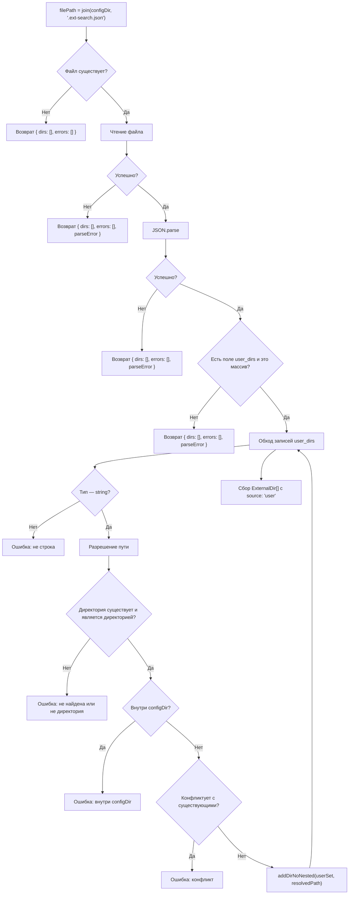

# Пользовательские директории из .ext-search.json

Плагин поддерживает загрузку внешних директорий из файла `.ext-search.json`, расположенного в configDir (рядом с `opencode.json`). Это позволяет добавлять внешние директории для поиска без изменения `opencode.json`, что полезно для машинно-специфичных или командных конфигураций.

Плагин может быть активен исключительно через `.ext-search.json` — без указания `directories` или `compile_commands_dir` в `opencode.json`.

## Расположение и формат файла

Файл `.ext-search.json` находится в configDir — той же директории, где расположен `opencode.json`, инициализирующий данный плагин.

Формат:

```json
{
  "user_dirs": [
    "path/to/dir1",
    "/absolute/path/to/dir2",
    "~/home/dir3"
  ]
}
```

Поле `user_dirs` — обязательный массив строк. Каждый элемент — путь к директории.

## Правила разрешения путей

| Формат пути | Правило разрешения |
|---|---|
| `~/…` | Относительно `$HOME` (`os.homedir()`) |
| `/absolute/path` | Как есть |
| `relative/path` | Относительно basePath (как и `directories` в `opencode.json`) |

Разрешение выполняется до валидации. Неразрешённые пути передаются в ошибки как есть (в исходном виде).

## Парсинг .ext-search.json

Функция `parseUserDirs(configDir, basePath, existingDirs, configDirAbs)` выполняет следующие шаги:



### Алгоритм валидации каждой записи

Для каждого элемента массива `user_dirs`:

1. **Проверка типа** — элемент должен быть строкой. Нестроковые элементы (`number`, `null`, `object` и т.д.) пропускаются с ошибкой.
2. **Разрешение пути** — согласно правилам из таблицы выше.
3. **Проверка существования** — `fsHost.statSync(resolvedPath)` должен вернуть информацию о директории. Если путь не существует или не является директорией — элемент пропускается с ошибкой.
4. **Проверка configDir** — разрешённый путь не должен совпадать с configDir или быть его поддиректорией (проверка через `isSubdirOf`). Нарушение — элемент пропускается с ошибкой.
5. **Проверка конфликта с существующими** — разрешённый путь не должен совпадать ни с одной из уже разрешённых директорий (config и cc) или быть их поддиректорией (проверка через `isOrInsideAny`). Нарушение — элемент пропускается с ошибкой.
6. **Дедупликация** — через `addDirNoNested(userSet, resolvedPath)`:
   - Если кандидат является поддиректорией уже добавленного user-пути — пропускается
   - Если кандидат является родительским к уже добавленным user-путям — дочерние удаляются, кандидат добавляется
   - Иначе — просто добавляется

### Очистка памяти

После извлечения массива `user_dirs` ссылки на распарсенный JSON обнуляются (`raw = null; parsed = null`) для освобождения памяти.

## Пометка директорий как disabled при наличии user-директорий

Функция `markDisabledByUserDirs(allDirs, userDirs)` проверяет каждую директорию из `allDirs` (кроме user-директорий): если она является поддиректорией одной из user-директорий, помечается `disabled: true`.

Это предотвращает дублирование: user-директория покрывает более широкую область файловой системы, и добавление вложенной config- или cc-директории привело бы к повторным результатам.

```
config-директория: /monorepo/shared-types    <- disabled (внутри /monorepo)
cc-директория:     /monorepo/libs/utils      <- disabled (внутри /monorepo)
user-директория:   /monorepo                 <- активна
```

## Объединение директорий

Порядок объединения: config -> cc -> user. После парсинга и пометки disabled формируется массив `activeDirPaths` — пути всех не-disabled директорий:

```
existingDirs = [...configExternalDirs, ...ccDirs]  // после markDisabledConfigDirs
allDirs = [...existingDirs, ...userResult.dirs]     // после markDisabledByUserDirs
activeDirPaths = allDirs.filter(d => !d.disabled).map(d => d.path)
```

`activeDirPaths` передаётся во все потребители: вспомогательный поиск, авто-permit, strict-paths, deps_read.

## Обработка ошибок

| Условие | variant | Сообщение |
|---|---|---|
| Ошибка чтения файла | error | `Failed to read .ext-search.json: <error>` |
| Невалидный JSON | error | `Failed to parse .ext-search.json: <error>` |
| Отсутствует поле `user_dirs` или не массив | error | `.ext-search.json: expected "user_dirs" array` |
| Элемент не строка | error | `User directory must be a string, got <type>` |
| Директория не найдена | error | `User directory not found: <путь>` |
| Путь не является директорией | error | `User directory not a directory: <путь>` |
| Директория внутри configDir | error | `User directory "<путь>" is inside configDir, skipping` |
| Конфликт с существующей директорией | error | `User directory "<путь>" conflicts with existing external directory, skipping` |

При любой ошибке парсинга (чтение, JSON, структура) плагин продолжает работу с config- и cc-директориями. При невалидной user-директории показывается toast (`error`) для каждой, валидные user-директории добавляются.

## Логирование

- Debug: путь к файлу `.ext-search.json`, факт отсутствия файла, время парсинга JSON, количество записей
- Info: завершение парсинга (количество извлечённых директорий, количество ошибок), пометка директорий как disabled (с указанием пути и источника)
- Error: ошибка чтения файла, ошибка парсинга JSON, некорректная структура
